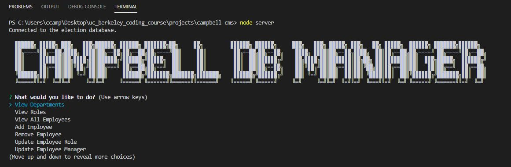

# campbell-cms
 - Application for updating, add, and removing employees from database
 - Leverages inquirer to prompt questions to users
 - ASCII artwork incorporated for aesthetics
 - Add employee manager functionality uses a dynamic list of employees with job titles 'manager' or 'CEO' to provide a dropdown list of managers
 - Adding role to an employee will provide a text list of job titles but pull the role_id when adding employee to the database
 - Using join functionality to present data from across department, roles & employee tables

 Deployed application not available as this must run in Node.js

 